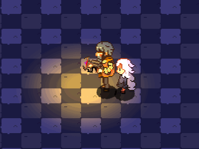
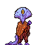

# Low Light Engine

A personal, in-progress Rust game engine built on top of [macroquad](https://github.com/not-fl3/macroquad).  
*Low Light Engine* is focused on 2D game prototyping and development for my personal projects. This passion project is primarily a learning exercise and is not intended for widespread use.

---

## Overview

Low Light Engine is designed to be a flexible and modular toolset for 2D game development. Currently, it is in the early stages of development, and as new systems and features are added, this README will be updated with documentation on architecture and implementation details.

---

## Goals (and Non-Goals)

**Primary Goals:**

- Develop various tools and systems to assist in 2D game development.
- Create a flexible engine that allows for rapid prototyping.
- Learn and experiment with Rust and game development patterns in a real-world project.

**Non-Goals:**

- This engine is not intended to be a full-featured, production-ready engine.
- The focus is on personal learning and development rather than wide-scale adoption.

---

## Platforms

The following are the platforms I intend to support.  
*Platforms marked with a star are not currently supported.*

- [ ] PC (Windows, Linux, and Mac)
- [ ] PS4 *
- [ ] XBOX *
- [ ] Android
- [ ] iOS
- [ ] Switch *

---

## Features

**Planned Features:**

- [ ] Basic level editor with prototyping textures (see the assets directory for sample textures)
- [ ] Preview window for sprites and animation timing
- [ ] Additional tools and systems to aid in 2D game development

---

## Architecture

The engine’s architecture is still evolving. Below are some of the design decisions and considerations currently under evaluation.

### Global State Management System

The engine uses a simple state machine based on an enum to define overall game states. This approach was chosen for its simplicity and scalability while avoiding overly complex OOP emulation in Rust.

```rust
enum GameState {
    Loading,
    MainMenu,
    Playing,
    Paused,
}
```

A dedicated struct holds the current game state and manages transitions. This design breaks up macroquad’s single loop, providing a more organized framework for handling state-specific logic.

### Entities and Objects

For handling players and other game entities, I am exploring a hybrid ECS (Entity-Component System) approach. In this model:

- **Data is stored in structs and enums.**  
  Entities are represented by structs containing properties like position, health, etc.
  
- **Systems operate on this data.**  
  Functions and modules process the data to perform game logic, rendering, and other behaviors.

I am also considering pulling in the [bevy_ecs](https://docs.rs/bevy_ecs) crate in the future if performance demands it. This approach aims to strike a balance between flexibility and efficiency while leveraging Rust’s strengths in type safety and pattern matching.


### Map Data

I'm still evaluating the best approach for handling map data. The two main options are:  

1. **Using Tiled** – A well-established and widely used tilemap editor. I will likely rely on Tiled in the early stages of development, as it provides robust features and a proven workflow.  
2. **Creating a Custom Map Editor** – In the future, I may develop a custom editor using [egui](link), similar to [Porymap](link). A dedicated in-engine editor could streamline the workflow and better integrate with the engine’s systems.  

Regardless of which editor is used, **the engine will store map and save data in JSON format**. While I considered other formats like XML, JSON's widespread support and ease of use make it the best choice for interoperability and flexibility.  
This approach ensures that maps can be easily modified, exported, and integrated into the engine as it evolves.

---

## Art and Assets
At the moment the engine is focused mainly on supporting 32x32 textures with some 32x64 textures for entities. In the future the engine may look to support other tile sizes.

### Current Textures

Below are some textures currently available in the `assets/` directory. These textures are for prototyping and may change as the engine evolves.

- **Texture Example 1**  
    
  *The base prototyping tile that will be used for empty game levels and tiles that don't have a texture yet*

  This tile was heavily inspired by this gif posted by the Pixpil devs:
    


- **Texture Example 2**  
    
  *Early design for an enemy maybe*

---

## Contributing

At this stage, Low Light Engine is a personal project. Contributions are welcome if you have suggestions, improvements, or ideas—but please keep in mind that the project is a learning exercise and may undergo significant changes.

---

## License: GNU General Public License v3.0

Low Light Engine is released under the GNU General Public License v3.0 (GPLv3). This license grants you the freedom to use, modify, and redistribute the engine, provided that any derivative works or modifications are also distributed under the same license. In essence, if you build upon or integrate Low Light Engine into your own project, your project must also be released under GPLv3, ensuring that the source code remains open and freely available. The engine is provided "as-is", without any warranty, and by using it you agree to abide by these terms and conditions.
